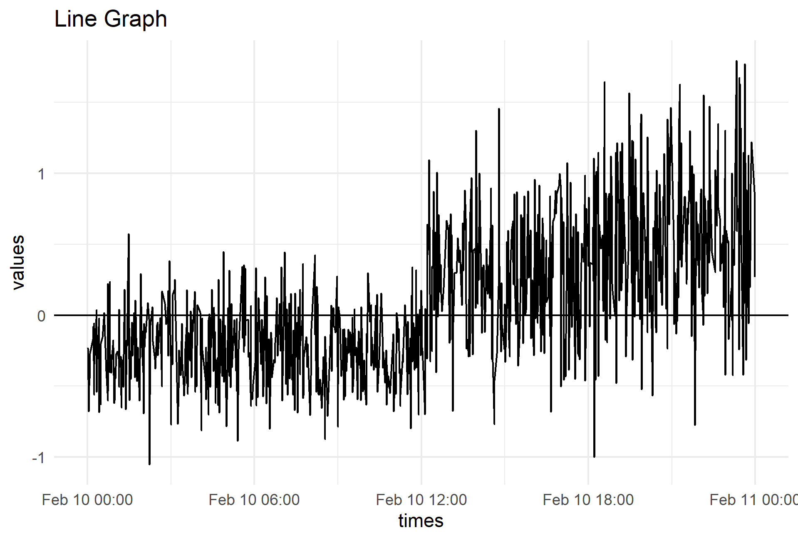

# Shaded Line Graphs in R

This repository contains the code and output for a recent blog entry on maryfalling.wordpress.com

Line graphs can be color-coded based on positive/negative values by manipulating the dataset and the `geom_area()` layer. Each time the line crosses the x-axis, a "boundary point" at 0 will help maintain the structure of the graph.

